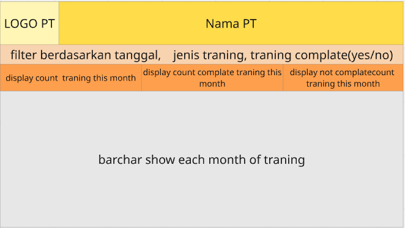
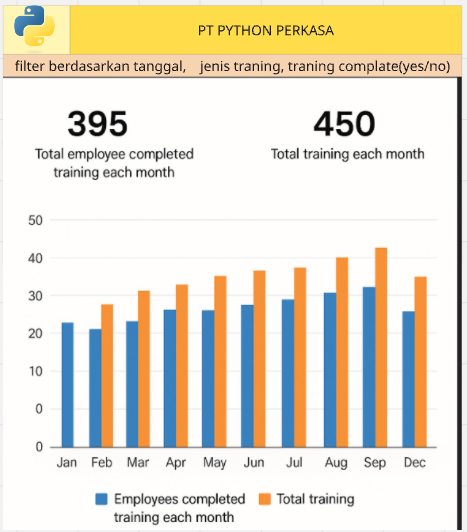
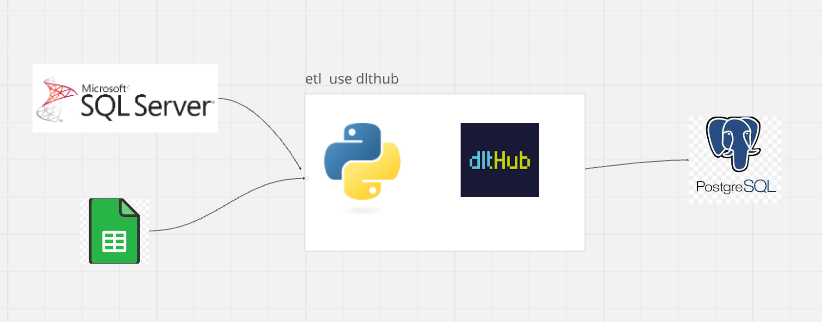

## Data Engineer Assessment Test

This repository contains solutions for a data engineering assessment test, which includes creating tables, inserting data, querying databases, designing an ETL flow, and building reports and dashboards. Below is an overview of the tasks and their corresponding files.

---

### Table of Contents
1. [Data and Query Task (Basic)](#data-and-query-task-basic)
2. [ETL, Data Warehouse, and Analytics Task](#etl-data-warehouse-and-analytics-task)
3. [Project Structure](#project-structure)

---

## Data and Query Task (Basic)

### 1. Create Script to Create Table for Each Object
- **File**: [Create Script to Create Table for Each Object.sql](Create%20Script%20to%20Create%20Table%20for%20Each%20Object.sql)
  - Contains SQL scripts to create the `Employee` and `PositionHistory` tables.

### 2. Create Insert Script to Insert Data into Each Table
- **File**: [Create Insert Script to Insert Data into Each Table.sql](Create%20Insert%20Script%20to%20Insert%20Data%20into%20Each%20Table.sql)
  - Contains SQL scripts to insert sample data into the `Employee` and `PositionHistory` tables.

### 3. Create Query to Display All Employee Data with Their Current Position Information
- **File**: [Create Query to Display All Employee Data with Their Current Position Information.sql](Create%20Query%20to%20Display%20All%20Employee%20Data%20with%20Their%20Current%20Position%20Information.sql)
  - Contains a SQL query to retrieve employee details along with their current position information.

---

## ETL, Data Warehouse, and Analytics Task

### 1. Design Simple ETL Flow
- **File**: [etl.py](etl.py)
  - Python script using the `dlt` library to extract data from Azure SQL Server (employee data) and Google Worksheet (training history), transform it, and load it into a PostgreSQL database.
  - **Sources**:
    - **Azure SQL Server**: Extracts employee data.
    - **Google Worksheet**: Extracts training history data.
  - **Transformations**:
    - Cleans and formats data (e.g., converting dates).
  - **Destination**:
    - Loads transformed data into a PostgreSQL database as dimension (`dim_employee`) and fact (`fact_training_history`) tables.

### 2. Design Simple Report
- **Report Description**:
  - Displays historical training data, allowing users to filter by date, training type, and completion status (yes/no).

### 3. Design Simple Dashboard
- **Dashboard Description**:
  - **Main Framework**:
    - 
  - **Metrics**:
    - Total employees who completed training each month.
    - Total training sessions each month.
  - **Visualization**:
    - Bar chart showing the number of trainings per month.
  - **Filters**:
    - Date range, training type, completion status.
  - **Sample Output**:
    - 

### 4. ETL Pipeline Diagram
- **Diagram**:
  - 
  - Shows the flow of data from Azure SQL Server and Google Worksheet to PostgreSQL via Python and dltHub.

---

## Project Structure

```
.
├── Create Script to Create Table for Each Object.sql
├── Create Insert Script to Insert Data into Each Table.sql
├── Create Query to Display All Employee Data with Their Current Position Information.sql
├── etl.py
├── Dashboard_Screenshot.png
├── ETL_Pipeline_Diagram.png
└── README.md
```

---

## How to Run the ETL Pipeline

1. **Prerequisites**:
   - Install required Python libraries: `pymssql`, `gspread`, `oauth2client`, `pandas`, `sqlalchemy`, and `dlt`.
   - Configure credentials for Azure SQL Server and Google Worksheet.

2. **Execution**:
   - Run the `etl.py` script to execute the ETL pipeline.
   - The script will:
     - Extract data from Azure SQL Server and Google Worksheet.
     - Transform the data.
     - Load it into a PostgreSQL database.
